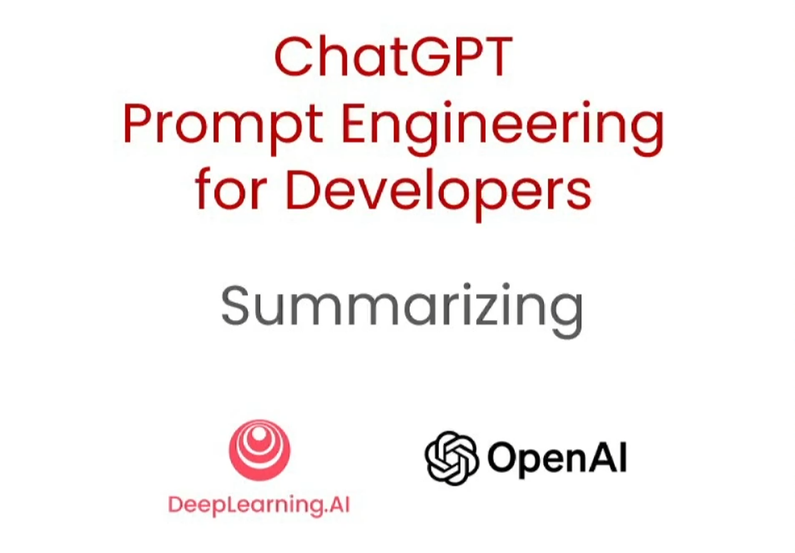
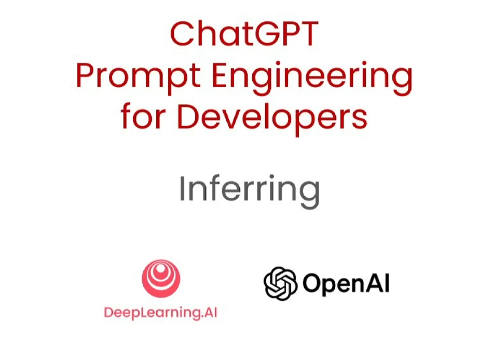
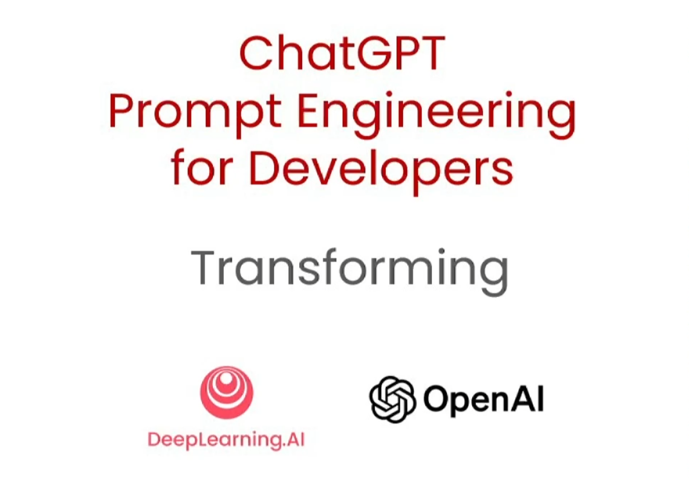
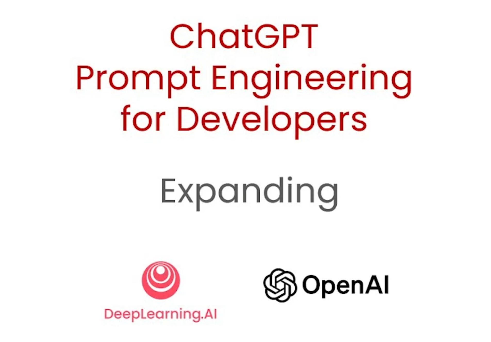
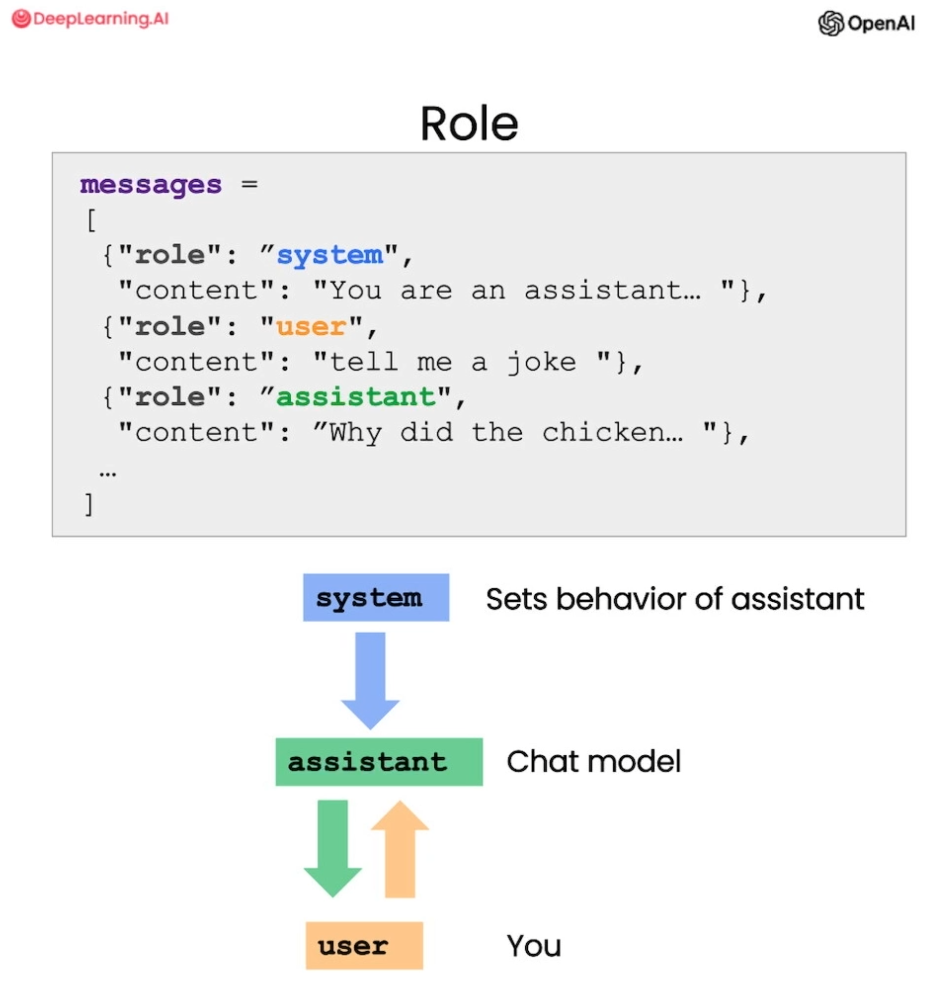
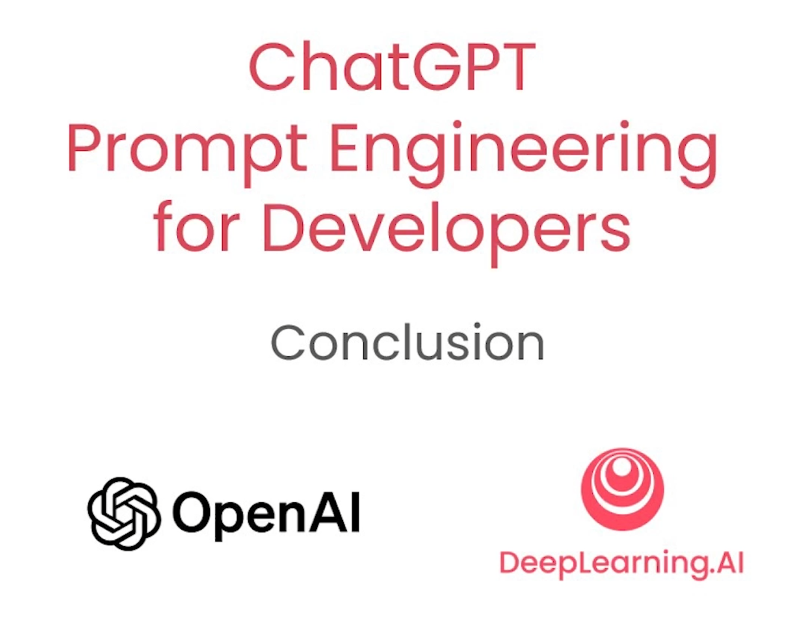

# Cours | [ChatGPT Prompt Engineering for Developers](https://www.deeplearning.ai/short-courses/chatgpt-prompt-engineering-for-developers/)

**English** | [Français](../fr/README.md) | [Português](../pt/README.md)

- **Crédit**: [DeepLearning.AI](https://www.deeplearning.ai) et [OpenAI](https://openai.com/)
- **Author of this page**: [Pierre Guillou](https://www.linkedin.com/in/pierreguillou)
- **Date**: June 6, 2023
- **Background**: This course originally created for developers teaches the principles and tactics to use to control ChatGPT, i.e. lead it through a natural language instruction to write text that meets your expectations. However, since it's basically learning to talk to ChatGPT and it's possible to do it without any code (i.e. in a web interface), it seemed to me that everyone could benefit from this course. Thus, I decided to summarize each of its chapters and list the key points put forward by the trainers Isa Fulford (OpenAI) and Andrew Ng (DeepLearning.AI). In addition to English speakers, I have also decided to facilitate its access to French and Portuguese speakers with versions translated into their respective languages.
- **Realization**: So, how to do all this as quickly as possible? Of course, I worked with an assistant... by the name of [ChatGPT 4](https://openai.com/gpt-4). Using my personal account on OpenAI, I asked ChatGPT to summarize the text transcripts of each of the videos in the course, to extract the key points in the form of a list, then translate their textual answers (the instructions used can be found in the appendix). I then did a proofreading of the texts and possibly made some alterations when I deemed it necessary (nothing essential). Finally, I integrated all texts into github.
- **Note**: The text transcripts and notebooks are made available via links to allow everyone to source the information on this page and facilitate their implementation. However, you must register on the course page to watch the videos.

## Summary

- [Lesson 1 - Introduction](#lesson-1---introduction)
- [Lesson 2 - Principles and tactics](#lesson-2---principles-and-tactics)
- [Lesson 3 - Interactive instruction](#lesson-3---interactive-instruction)
- [Lesson 4 - Summary and information extraction](#lesson-4---summary-and-information-extraction)
- [Lesson 5 - Inference (classification, topic detection, information extraction)](#lesson-5---inference-classification-topic-detection-information-extraction)
- [Lesson 6 - Transformations](#lesson-6---transformations)
- [Lesson 7 - Assistant](#lesson-7---assistant)
- [Lesson 8 - ChatBot](#lesson-8---chatbot)
- [Lesson 9 - Conclusion](#lesson-9---conclusion)
- [Appendix](#appendix)

## Lesson 1 - Introduction


- **Ressource**: [transcription 1](https://github.com/piegu/language-models/edit/master/chatgpt/deeplearning_ai_chatgpt_prompt_engineering_course/transcripts/transcript_video1.txt)

- **Summary**: This course offers a comprehensive guide to engineering ChatGPT instructions for developers. It covers best practices for developing software using Large Language Models (LLMs), including the use of API calls for building applications. It differentiates between Core LLMs and Instructional LLMs, highlighting the benefits and applications of the latter. The course also illustrates the importance of clear and specific instructions when using these models.
- **Key points**:
  - The course is co-facilitated by OpenAI staff member Isa Fulford, who has significant experience with Large Linguistic Models (LLMs) and teaching prompt techniques, and Deep Learning professor Andrew Ng at Stanford University and creator of DeepLearning.AI.
  - It emphasizes the underestimated power of LLMs for developers to quickly build software applications using API calls.
  - The program will cover best practices for prompting (statement strategy), common use cases (such as summarizing, inferencing, transforming, expanding) and practical applications like building a chatbot using an LLM.
  - The course differentiates between two types of LLMs: Basic LLMs that predict the next word based on text training data, and instruction-tuned LLMs that follow specific instructions.
  - LLMs tuned to instructions are preferred because of their ability to follow instructions, and their safety features that make them less likely to produce toxic outputs.
  - The course emphasizes the importance of clear and specific instructions for best results from an LLM granted to instructions.
  - A number of OpenAI and DeepLearning.AI contributors played a significant role in creating the course materials.

## Lesson 2 - Principles and Tactics


- **Resources**:
  - [transcription 2](https://github.com/piegu/language-models/edit/master/chatgpt/deeplearning_ai_chatgpt_prompt_engineering_course/transcripts/transcript_video2.txt)
  - [l2-guidelines.ipynb](https://github.com/piegu/language-models/edit/master/chatgpt/deeplearning_ai_chatgpt_prompt_engineering_course/notebooks/l2-guidelines.ipynb)

- **Summary**: In this course, Isa discusses guidelines for effective prompting with language models, with an emphasis on clarity and specificity of instructions and the time given to the model to process complex tasks. Additionally, it introduces practical tactics such as the use of delimiters, structured output requests, statement verification, and model-based learning from a few examples. Lessons are illustrated with sample instructions involving tasks such as summarizing and translating texts, as well as solving mathematical problems. The section ends by announcing the next lesson, dealing with the process of iterative instruction development.

- **Principle 1**: **Write clear and specific instructions**
  - **Objective**: To provide explicit and clear guidelines to guide the model to the desired output and reduce irrelevant or incorrect answers. Warning: clear instructions do not mean short.
  - **Tactics**:
	1. **Use of Delimiters**: Clearly mark separate parts of the input with specific punctuation marks or symbols to help the model better understand the instruction. You can use the following delimiters for example: ```, """, < >, <tag> </tag>
	2. **Request structured output**: This can make it easier to parse model outputs, by requesting structured outputs like HTML or JSON, or even a list.
	3. **Condition Checking**: Instruct the model to check assumptions first, helping to avoid errors and unexpected results. Ask it for a different output if the condition is verified or not.
	4. **Invite to draw inspiration from some examples**: Provide examples of successful task executions to guide understanding of the required task model.

- **Principle 2**: **Help the model think**
  - **Objective**: For complex tasks, helping the model "think" can avoid hasty incorrect conclusions. This involves instructing the model to devote more computational effort to the task.
  - **Tactics**:
	1. **Specifying steps for tasks**: Detailing the steps for the model to accomplish a task can improve its performance and ensure that it returns the desired result. The course demonstrated this with a task involving summarizing, translating, extracting names, and outputting JSON (after listing the tasks chronologically, tell the model the format of its output).
	2. **Ask the model to find its own solutions**: The AI ​​model can be guided to reason solutions independently before evaluating the solutions of others. The course demonstrated this with a math problem, where the model was able to identify an error in a student's solution only when prompted to solve the problem itself first.

**Model limits**: **"Hallucinations"**
- The course warns of a limit where the model can generate plausible but fabricated responses, known as "hallucinations". An example was shown where the model was asked to describe a non-existent toothbrush model and gave a realistic but invented description.
- To minimize hallucinations, the model can be asked to find relevant quotes in a text and use these quotes to answer questions. This approach can help trace the response back to the source document, providing a more reliable response.

## Lesson 3 - Interactive instruction


- **Resources**:
  - [transcription 3](https://github.com/piegu/language-models/edit/master/chatgpt/deeplearning_ai_chatgpt_prompt_engineering_course/transcripts/transcript_video3.txt)
  - [l3-iterative-prompt-development.ipynb](https://github.com/piegu/language-models/edit/master/chatgpt/deeplearning_ai_chatgpt_prompt_engineering_course/notebooks/l3-iterative-prompt-development.ipynb)

- **Summary**: Andrew emphasizes the importance of iterative instruction development when using large language models. It is not crucial that an instruction works perfectly the first time. It is the improvement of training based on results that is the key to success. Andrew uses the example of generating a summary for a chair spec sheet, refining the statement to meet various constraints such as length, technical detail, and format of text produced by ChatGPT. The importance of testing instructions on larger data sets as applications mature is also emphasized.

- **Key points**:
  - Developing effective instructions for large language models is an iterative process.
  - Perfect instruction is usually not achieved on the first attempt, but rather improves over time based on application requirements and previous results.
  - An example was given of refining an instruction to generate a summary of a chair spec sheet, adjusting for factors such as word count, inclusion of technical details, and output format (here, HTML).
  - It has been noted that large language models can sometimes struggle with instructions for very precise word or character counts, but this is not the case with ChatGPT which is quite reliable on this subject.
  - As applications become more mature, it can be beneficial to evaluate and refine instructions against larger sets of examples to ensure consistent performance across various use cases.
  - The instruction development process is important, if not more, than knowing the perfect instruction. It's about having a good process for developing effective instructions for specific applications.

## Lesson 4 - Summary and Information Extraction



- **Resources**:
  - [transcription 4](https://github.com/piegu/language-models/edit/master/chatgpt/deeplearning_ai_chatgpt_prompt_engineering_course/transcripts/transcript_video4.txt)
  - [l4-summarizing.ipynb](https://github.com/piegu/language-models/edit/master/chatgpt/deeplearning_ai_chatgpt_prompt_engineering_course/notebooks/l4-summarizing.ipynb)

- **Summary**: Andrew discusses the usefulness of large language models in summarizing texts, especially reviews on an e-commerce site. It demonstrates how these templates can generate summaries or extract specific information relevant to different departments (like shipping or pricing), facilitating a more efficient and focused review process. A code is also introduced to effectively summarize multiple reviews, allowing quick access to their content.

- **Key points**:
  - Large language models can be used to summarize large volumes of text, enabling effective understanding of content.
  - Specific summary can be generated according to the requirements of different departments, such as shipping or pricing, with tailored instructions.
  - Andrew introduced the concept of extracting specific information rather than providing a general summary, which might be more appropriate for certain departments.
  - A practical implementation of a multiple review summary code was shown, allowing quick access to the essence of multiple reviews.
  - Large language models not only help in summarizing, but could also help in making inferences from texts, such as determining positive or negative sentiment in product reviews, which will be discussed in the next session.

## Lesson 5 - Inference (classification, topic detection, information extraction)



- **Resources**:
  - [transcription 5](https://github.com/piegu/language-models/edit/master/chatgpt/deeplearning_ai_chatgpt_prompt_engineering_course/transcripts/transcript_video5.txt)
  - [l5-inferring.ipynb](https://github.com/piegu/language-models/edit/master/chatgpt/deeplearning_ai_chatgpt_prompt_engineering_course/notebooks/l5-inferring.ipynb)

- **Summary**: Andrew discusses how large language models can be used to infer various information from text, such as sentiment, expressions of emotions, or to extract product details or marks, subject detection, and how they can handle multiple tasks simultaneously using one codified instruction. It further explains applications of these models for customer reviews, identifying specific features in text, and zero-shot learning for topic detection in news articles.

- **Key points**:
  - Large language models can perform various inferential tasks like sentiment analysis, name and label extraction, and context understanding using simple textual instructions.
  - Models can process and provide analysis on a text string more efficiently and quickly compared to the traditional machine learning workflow that requires separate models for different tasks.
  - Using specific instructions, models can not only classify the sentiment of a review, but also identify the list of emotions expressed and assess whether a customer is particularly upset. This information can be valuable to customer support organizations.
  - Information extraction is another important capability of large language models which can be used to extract and summarize key information like product and manufacturer from a large collection of reviews.
  - Large language models can also handle multitasking statements, extracting multiple fields from a text string in a single statement, saving processing time and resources.
  - These models can infer topics from a large piece of text, which makes them useful for analyzing and categorizing large bodies of text like news articles.
  - Zero-shot training allows the model to identify which topics from a predefined list are covered in a given text without any specific training data.
  - Large language models can quickly build multiple systems for text inferences that would previously have taken considerable time even for experienced machine learning developers.

## Lesson 6 - Transformations



- **Resources**:
  - [transcription 6](https://github.com/piegu/language-models/edit/master/chatgpt/deeplearning_ai_chatgpt_prompt_engineering_course/transcripts/transcript_video6.txt)
  - [l6-transforming.ipynb](https://github.com/piegu/language-models/edit/master/chatgpt/deeplearning_ai_chatgpt_prompt_engineering_course/notebooks/l6-transforming.ipynb)

- **Summary**: Isa showcases several capabilities of the major language models, especially GPT-4, including text translation, tone transformation, spelling and grammar corrections, and format conversions. It shows how to use GPT-4 in translation tasks across various languages ​​and levels of formality, introduces the concept of tone transformation in writing, and demonstrates proofreading capabilities. In addition, it shows the conversion of data from one format (JSON) to another (HTML).

- **Key points**:
  - Large language models can translate text across multiple languages, including informal and formal versions.
  - They can detect the language of a given text, useful in a multilingual environment like a multinational e-commerce company.
  - Templates can change the tone of written text, like turning slang into business language.
  - They can convert data between different formats (for example: JSON to HTML).
  - GPT-4 can help proofread and correct grammar and spelling errors in text.
  - GPT-4 can also help transform text to fit certain styles and formats, such as APA style and markdown format.

## Lesson 7 - Assistant



- **Resources**:
  - [transcription 7](https://github.com/piegu/language-models/edit/master/chatgpt/deeplearning_ai_chatgpt_prompt_engineering_course/transcripts/transcript_video7.txt)
  - [l7-expanding.ipynb](https://github.com/piegu/language-models/edit/master/chatgpt/deeplearning_ai_chatgpt_prompt_engineering_course/notebooks/l7-expanding.ipynb)

- **Summary**: Isa discusses the various uses of large language models, including translation between different languages ​​and formats, spelling and grammar correction, pitch shifting, and text expansion. She also describes how to improve the instructions for the template to get more accurate results and how to create an AI customer service assistant to respond to customer reviews.

- **Key points**:
  - Great language models can translate text between different languages ​​and formats, and can help with spelling and grammar correction.
  - With proper instruction, the template can change the tone of a text to suit different audiences.
  - Language models can be used to transform short texts into longer texts, useful for generating more detailed content from prompts.
  - The template can be used as an AI customer service assistant to generate personalized responses to customer reviews.
  - The temperature parameter can be used to control the degree of exploration or variability in model responses.
  - It is important to iterate and adjust instructions to get more accurate results.
  - It is crucial to be transparent when AI generates text for users, letting them know that the text was generated by a language model.

## Lesson 8 - ChatBot



- **Resources**:
  - [transcription 8](https://github.com/piegu/language-models/edit/master/chatgpt/deeplearning_ai_chatgpt_prompt_engineering_course/transcripts/transcript_video8.txt)
  - [l8-chatbot.ipynb](https://github.com/piegu/language-models/edit/master/chatgpt/deeplearning_ai_chatgpt_prompt_engineering_course/notebooks/l8-chatbot.ipynb)

- **Summary**: Isa discusses how to use a broad language model to build a custom chatbot. She explains the OpenAI ChatCompletions format, the role of system and user messages, and the importance of providing context to the model to generate accurate responses. She presents examples of using the chatbot for different tasks, such as generating Shakespearean jokes and collecting pizza orders. The transcript also covers the process of creating a user interface and adding messages to the conversation context. Finally, it shows how to generate a conversation-based JSON digest for further processing.

- **Key points**:
  - Broad language models can be used to build custom chatbots for various tasks.
  - The chat format involves the use of a list of messages, including system and user messages.
  - System messages help define the behavior and personality of the assistant without the user being aware of it.
  - Providing context is crucial for the model to generate accurate answers.
  - A user interface can be created to interact with the chatbot and collect user queries.
  - Conversations can be extended by adding messages to the context.
  - The template can generate JSON digests based on the conversation for further processing.
  - Customization of chatbot behavior and personality can be achieved by modifying the system message.

## Lesson 9 - Conclusion



- **Resources**:
  - [transcription 9](https://github.com/piegu/language-models/edit/master/chatgpt/deeplearning_ai_chatgpt_prompt_engineering_course/transcripts/transcript_video9.txt)

- **Summary**: Isa and Andrew conclude this short lesson on query formulation techniques which highlights two key principles: writing clear and specific instructions, and giving the model time to think. They highlight the importance of iterative query development and exploring the different capabilities of large language models, such as synthesis, inference, transformation, and expansion. They encourage learners to explore their own project ideas, starting with small projects and gradually improving their skills. The responsible use of AI tools is emphasized, and the course creators express their enthusiasm for the potential of the field. The transcript ends with thanks and an invitation to share the completed projects.

- **Key points**:
  - Two key principles for formulating queries: clear instructions and time for the model to think.
  - The importance of iterative query development to find the right approach for specific applications.
  - Different capabilities of large language models, such as synthesis, inference, transformation and expansion.
  - Encouragement to explore own project ideas, even starting with small or fun projects.
  - The excitement and growth potential of building applications with large language models.
  - The importance of responsible use of AI tools, with a focus on positive impact.
  - Invitation to share and publicize the course as well as the projects carried out.

## Appendix

### Prompt 1

```
You are a course teacher. 
Summarize the transcript delimited by triple quotes at most 80 words. 
Then, extract the most important points of the transcript as a list with a short explanation if necessary.

Follow the following format:
Summary: <summary of the transcript>
Key points: <most important points of the transcript as a list>
- ...
- ...
- ...

Transcript:
"""
<transcript>
"""
Summary: 
Key points:
```

### Prompt 2
```
Translate the summary and key points into French and Portuguese.
```

### Prompt 3 (if necessary)
```
Keep writing until the translation is finished.
```

