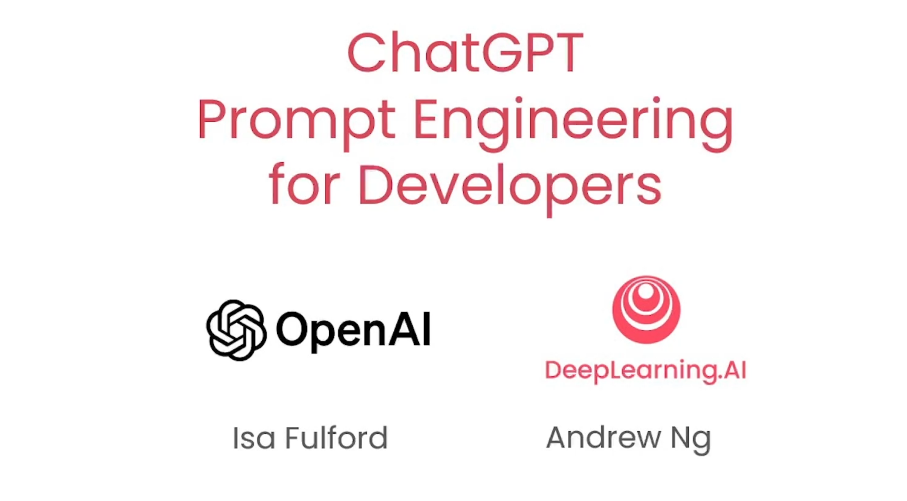
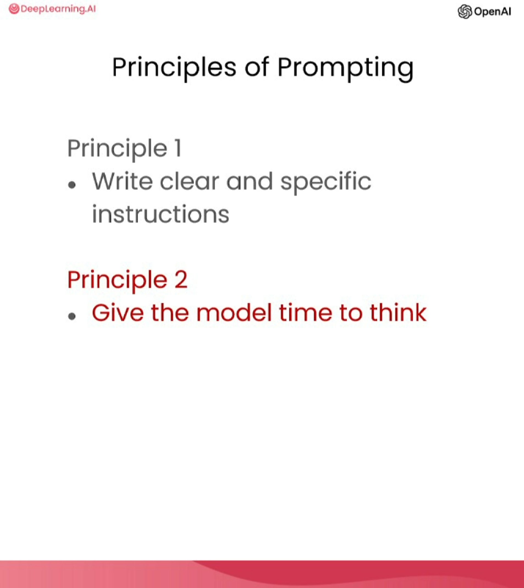
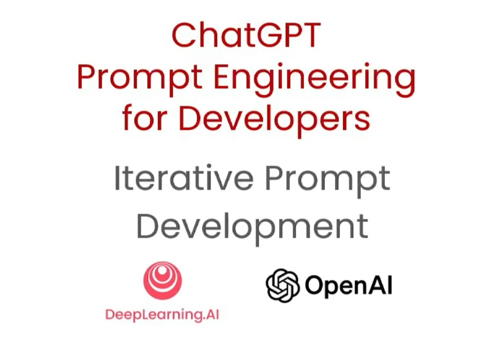

# Cours : [ChatGPT Prompt Engineering for Developers](https://www.deeplearning.ai/short-courses/chatgpt-prompt-engineering-for-developers/)
De DeepLearning.AI et OpenAI

**Note**: page écrite par ChatGPT 4.

## Leçon 1 - Introduction



- **Ressource**: [transcription 1](https://github.com/piegu/language-models/edit/master/chatgpt/deeplearning_ai_chatgpt_prompt_engineering_course/transcripts/transcript_video1.txt)

- **Résumé**: Ce cours offre un guide complet sur l'ingénierie des instructions ChatGPT pour les développeurs. Il couvre les meilleures pratiques pour le développement de logiciels utilisant les grands modèles linguistiques (LLMs), y compris l'utilisation d'appels API pour la construction d'applications. Il différencie les LLMs de base et les LLMs accordés aux instructions, mettant en évidence les avantages et les applications de ces dernières. Le cours illustre également l'importance des instructions claires et spécifiques lors de l'utilisation de ces modèles.
- **Points clés**: 
  - Le cours est co-animé par Isa Fulford, membre du personnel d'OpenAI, qui a une expérience significative avec les Grands Modèles Linguistiques (LLMs) et l'enseignement des techniques de prompt, ainsi que par Andrew Ng, professeur de Deep Learning à l'université de Stanford et créateur de DeepLearning.AI.
  - Il met l'accent sur le pouvoir sous-estimé des LLMs pour les développeurs pour construire rapidement des applications logicielles en utilisant des appels API.
  - Le programme couvrira les meilleures pratiques pour le prompting (stratégie d'instructions), des cas d'utilisation communs (tels que la résumé, l'inférence, la transformation, l'expansion) et des applications pratiques comme la construction d'un chatbot en utilisant un LLM.
  - Le cours fait la différence entre deux types de LLMs: les LLMs de base qui prédisent le mot suivant en fonction des données d'entraînement de texte, et les LLMs accordés aux instructions qui suivent des instructions spécifiques.
  - Les LLMs accordés aux instructions sont préférés en raison de leur capacité à suivre des instructions, et leurs caractéristiques de sécurité qui les rendent moins susceptibles de produire des sorties toxiques.
  - Le cours souligne l'importance d'instructions claires et spécifiques pour de meilleurs résultats d'un LLM accordé aux instructions.
  - Un certain nombre de contributeurs d'OpenAI et de DeepLearning.AI ont joué un rôle significatif dans la création des matériaux du cours.

## Leçon 2 - Directives



- **Ressources**:
  - [transcription 2](https://github.com/piegu/language-models/edit/master/chatgpt/deeplearning_ai_chatgpt_prompt_engineering_course/transcripts/transcript_video2.txt)
  - [l2-guidelines.ipynb](https://github.com/piegu/language-models/edit/master/chatgpt/deeplearning_ai_chatgpt_prompt_engineering_course/notebooks/l2-guidelines.ipynb)

- **Résumé**: Dans ce cours, Isa discute des directives pour une invitation efficace avec les modèles de langage, avec un accent sur la clarté et la spécificité des instructions et le temps accordé au modèle pour traiter des tâches complexes. De plus, elle introduit des tactiques pratiques comme l'utilisation de délimiteurs, les demandes de sortie structurée, la vérification d'instructions, et l'invitation par quelques exemples. Les leçons sont illustrées par des exemples de prompts impliquant des tâches comme la résumé et la traduction de textes, ainsi que la résolution de problèmes mathématiques. La section se termine en annonçant la prochaine leçon, traitant du processus de développement itératif de prompts.

- **Principe 1**: **Rédiger des instructions claires et spécifiques**
  - **Objectif**: Fournir des directives explicites et claires pour guider le modèle vers la sortie souhaitée et réduire les réponses non pertinentes ou incorrectes. Attention: instructions claires ne veut pas dire courtes.
  - **Tactiques**:
    1. **Utilisation de délimiteurs**: Indiquer clairement les parties distinctes de l'entrée avec des signes de ponctuation ou des symboles spécifiques pour aider le modèle à mieux comprendre l'instruction. Vous pouvez utiliser les délimiteurs suivants par exemple: ```, """, < >, <tag> </tag>
    2. **Demander une sortie structurée**: Cela peut faciliter l'analyse des sorties du modèle, en demandant des sorties structurées comme HTML ou JSON.
    3. **Vérification de condition**: Instruire le modèle pour vérifier d'abord les hypothèses, aidant à éviter les erreurs et les résultats inattendus. Lui demander une sortie différente si la condition est vérifiée ou non.
    4. **Invitation à s'inspirer de quelques exemples**: Fournir des exemples de réussite d'exécutions de tâches pour guider la compréhension du modèle de la tâche requise.

- **Principe 2**: **Aider le modèle à réfléchir**
  - **Objectif**: Pour des tâches complexes, aider le modèle à "réfléchir" peut éviter des conclusions incorrectes précipitées. Cela implique d'instruire le modèle pour qu'il consacre plus d'efforts de calcul à la tâche.
  - **Tactiques**:
    1. **Spécification des étapes pour les tâches**: Détailler les étapes pour que le modèle puisse accomplir une tâche peut améliorer ses performances et garantir qu'il retourne le résultat souhaité. Le cours a démontré cela avec une tâche impliquant la résumé, la traduction, l'extraction de noms et la sortie JSON (après avoir listé de manière chronologique les tâches, indiquer au modèle le format de sa sortie).
    2. **Demander au modèle de trouver ses propres solutions**: Le modèle d'IA peut être guidé pour raisonner les solutions de manière indépendante avant d'évaluer les solutions des autres. Le cours a démontré cela avec un problème de mathématiques, où le modèle a pu identifier une erreur dans la solution d'un étudiant seulement lorsqu'il a été invité à résoudre le problème lui-même en premier.

**Limites du modèle**: **"Hallucinations"**
Le cours met en garde contre une limite où le modèle peut générer des réponses plausibles mais fabriquées, connues sous le nom de "hallucinations". Un exemple a été montré où le modèle a été invité à décrire un modèle de brosse à dents inexistant et a donné une description réaliste mais inventée.
    - **Réduction des hallucinations**: Pour minimiser les hallucinations, le modèle peut être invité à trouver des citations pertinentes dans un texte et utiliser ces citations pour répondre à des questions. Cette approche peut aider à retracer la réponse au document source, fournissant une réponse plus fiable.

## Leçon 3 - Instruction interactive



- **Ressources**:
  - [transcription 3](https://github.com/piegu/language-models/edit/master/chatgpt/deeplearning_ai_chatgpt_prompt_engineering_course/transcripts/transcript_video3.txt)
  - [l3-iterative-prompt-development.ipynb](https://github.com/piegu/language-models/edit/master/chatgpt/deeplearning_ai_chatgpt_prompt_engineering_course/notebooks/l3-iterative-prompt-development.ipynb)

- **Résumé**: La formatrice souligne l'importance du développement itératif de l'instruction lors du travail avec de grands modèles de langage. Il n'est pas crucial qu'une instruction fonctionne parfaitement la première fois, mais plutôt l'amélioration de l'instruction en fonction des résultats est la clé du succès. La formatrice utilise l'exemple de la génération d'un résumé pour une fiche technique de chaise, affinant l'instruction pour répondre à différentes contraintes comme la longueur, le détail technique, et le format du contenu. L'importance de tester les instructions sur des ensembles de données plus importants à mesure que les applications mûrissent est également soulignée.

- **Points clés**:
  - Le développement d'instructions efficaces pour les grands modèles de langage est un processus itératif.
  - L'instruction parfaite n'est généralement pas atteinte lors de la première tentative, mais plutôt elle s'améliore au fil du temps en fonction des exigences de l'application et des résultats précédents.
  - Un exemple a été donné de raffinement d'une instruction pour générer un résumé d'une fiche technique de chaise, ajustant pour des facteurs tels que le décompte des mots, l'inclusion de détails techniques, et le format de sortie (y compris le HTML).
  - Il a été noté que les grands modèles de langage peuvent parfois avoir du mal avec les instructions pour des décomptes de mots ou de caractères très précis, mais ils sont généralement fiables.
  - À mesure que les applications deviennent plus matures, il peut être bénéfique d'évaluer et d'affiner les instructions par rapport à de plus grands ensembles d'exemples pour assurer une performance constante dans divers cas d'utilisation.
  - Les principes directeurs pour le développement d'instructions incluent d'être clair et spécifique dans les instructions et de donner au modèle un temps de "réflexion" adéquat.
  - Le processus de développement d'instruction est aussi important, sinon plus, que de connaître l'instruction parfaite. Il s'agit d'avoir un bon processus pour développer des instructions efficaces pour des applications spécifiques.

## Leçon 4 - Résumer
- [transcription 4](https://github.com/piegu/language-models/edit/master/chatgpt/deeplearning_ai_chatgpt_prompt_engineering_course/transcripts/transcript_video4.txt)
- [l4-summarizing.ipynb](https://github.com/piegu/language-models/edit/master/chatgpt/deeplearning_ai_chatgpt_prompt_engineering_course/notebooks/l4-summarizing.ipynb)

## Leçon 5 - Inférence
- [transcription 5](https://github.com/piegu/language-models/edit/master/chatgpt/deeplearning_ai_chatgpt_prompt_engineering_course/transcripts/transcript_video5.txt)
- [l5-inferring.ipynb](https://github.com/piegu/language-models/edit/master/chatgpt/deeplearning_ai_chatgpt_prompt_engineering_course/notebooks/l5-inferring.ipynb)

## Leçon 6 - Transformer
- [transcription 6](https://github.com/piegu/language-models/edit/master/chatgpt/deeplearning_ai_chatgpt_prompt_engineering_course/transcripts/transcript_video6.txt)
- [l6-transforming.ipynb](https://github.com/piegu/language-models/edit/master/chatgpt/deeplearning_ai_chatgpt_prompt_engineering_course/notebooks/l6-transforming.ipynb)

## Leçon 7 - Développez
- [transcription 7](https://github.com/piegu/language-models/edit/master/chatgpt/deeplearning_ai_chatgpt_prompt_engineering_course/transcripts/transcript_video7.txt)
- [l7-expanding.ipynb](https://github.com/piegu/language-models/edit/master/chatgpt/deeplearning_ai_chatgpt_prompt_engineering_course/notebooks/l7-expanding.ipynb)

## Leçon 8 - Chatbot
- [transcription 8](https://github.com/piegu/language-models/edit/master/chatgpt/deeplearning_ai_chatgpt_prompt_engineering_course/transcripts/transcript_video8.txt)
- [l8-chatbot.ipynb](https://github.com/piegu/language-models/edit/master/chatgpt/deeplearning_ai_chatgpt_prompt_engineering_course/notebooks/l8-chatbot.ipynb)

## Leçon 9 - Conclusion
- [transcription 9](https://github.com/piegu/language-models/edit/master/chatgpt/deeplearning_ai_chatgpt_prompt_engineering_course/transcripts/transcript_video9.txt)
